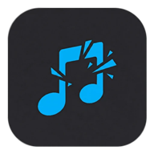
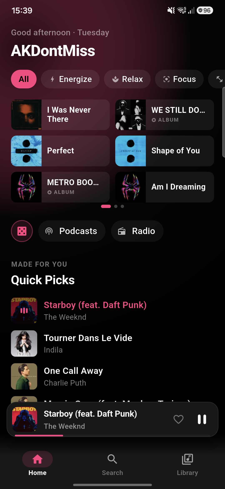
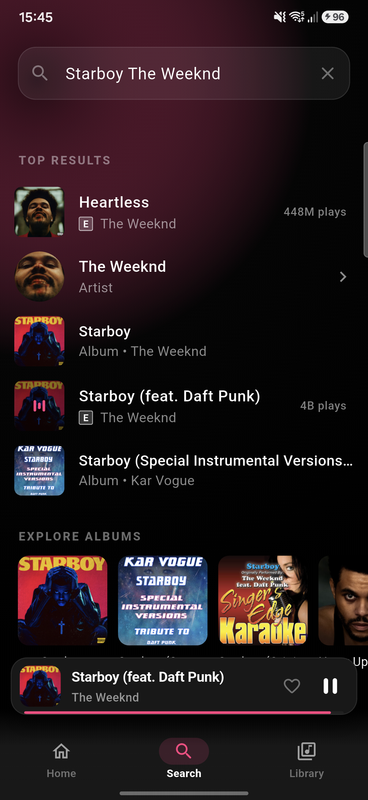
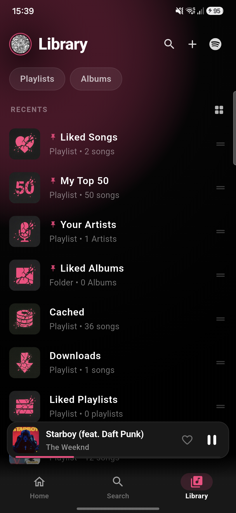
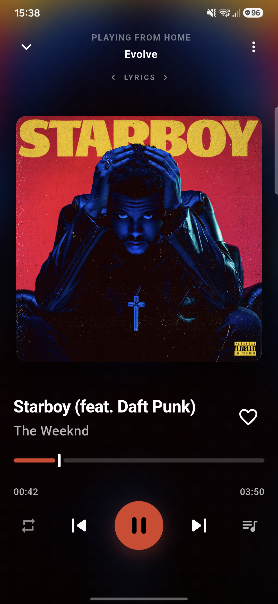
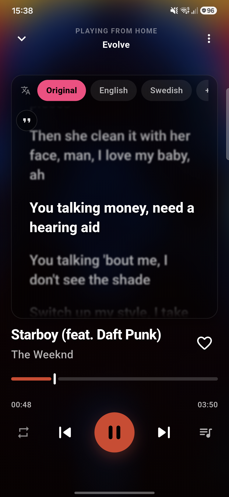
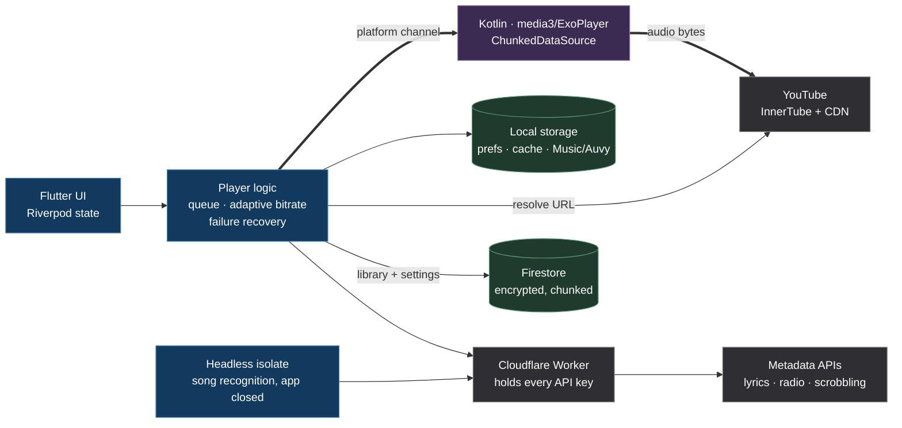

<div align="center">



# Auvy

### Music, podcasts and radio for Android

**~100k lines of Dart** across 185 files &middot; **14 Kotlin** classes on media3/ExoPlayer
&middot; a **3.6k-line Cloudflare Worker** fronting 7 third-party APIs
&middot; **421 tests** in 38 files

<br/>

[](../../releases)
[](LICENSE)
[](https://flutter.dev)

<br/>

[Why](#why-this-exists) &middot; [Engineering](#what-i-had-to-actually-design) &middot; [Features](#features) &middot; [Install](#install) &middot; [Privacy](#privacy) &middot; [Build](#build-it-yourself) &middot; [Licence](#licence)

</div>

---

<div align="center">







</div>

---

Auvy plays music from YouTube Music's catalogue, plus podcasts, live radio and
public-domain audiobooks. Your library stays on your phone. Cloud backup is
optional, encrypted, and readable only by you.

Android phones, no ads, no tracking.

---

## Why this exists

I'm an electrical engineering student. I built this to find out what AI coding
tools are actually good for, and the only way I trusted to find out was to build
something big enough that the answer would be obvious either way. Reading about
them tells you nothing. Shipping something you have to keep working does.

A music player turned out to be a good choice, because it looks simple and
isn't. It has to keep audio running with the screen off and the OS trying to
sleep the process, survive a network that comes and goes mid-track, hold a
library in sync across devices, and stay responsive while doing all of it. None
of that shows up in a feature list, and all of it has to work before anyone uses
the app twice.

I'm aiming at embedded systems, ideally the hardware and the software together.
That is really why this was worth the months: an Android app sitting on top of a
native media pipeline is the closest I can get on my own to the problems
embedded work actually has. Limited resources you have to budget. Code that must
keep running when nobody is looking at it. A boundary between two languages
where all the interesting bugs live.

## What I had to actually design



Blue is Dart, purple is Kotlin, green is storage. Two things in there are
worth pointing at.

**Audio does not go through the Worker.** Dart resolves a stream URL, then the
native side fetches the bytes itself in ranges. Proxying tens of megabytes of
audio per album through a Worker would be slow and would cost money for nothing.
The Worker only ever carries small metadata responses, which is also why it can
cache them at the edge.

**The API keys only exist on the Worker.** The APK ships none, so a forked build
supplies its own or those features sit inert. That is the reason the box in the
middle exists at all.

The feature list above was the easy half. These are the parts I got wrong first
and then had to understand properly.

**Caching, and what to throw away.** A phone has finite storage, so a cache is a
budget with an eviction policy, not a folder. Auvy keeps two classes of file:
auto-cached audio that is evictable, and downloads that never are. Eviction is
least-recently-used with the user's most-played tracks pinned, and it trims to a
low-water mark rather than to the limit — trimming to exactly the limit means the
next track trips it again, which I only noticed after reading a day of logs and
finding fifty evictions where there should have been eight.

**Adaptive control instead of guessing.** Audio quality is chosen from measured
throughput on a ladder of bitrates, and the decision is then frozen for the life
of a track. Freezing matters more than choosing: a re-resolve mid-track that
picks a different format hands the player a different file, and the byte offset
it was about to read no longer means anything.

**Designing for failure, not around it.** Stream URLs expire. The CDN will serve
the first megabyte and then refuse the rest. Clients get refused and have to be
rotated. Nearly all of the playback code is about detecting which of those is
happening and recovering without the listener hearing it, with bounded retries
and escalating backoff so a genuinely dead stream stops costing requests.

**Crossing a language boundary.** The UI is Dart, the player is Kotlin on
media3/ExoPlayer, and background recognition runs in a headless Dart isolate with
no screen at all. Three processes' worth of state has to agree. The subtlest bug
I have found in this project lived exactly there: shared preferences are cached
in memory per isolate, so a value written by Kotlin was invisible to a running
Dart isolate until it reloaded — the feature only appeared to work after
restarting the app.

**An API gateway, and key custody.** A Cloudflare Worker sits in front of every
third-party API. It holds the keys so they are not in the APK, enforces a method
allowlist, and caches at the edge with per-route TTLs. Getting the cache key
wrong there is instructive: Cloudflare caches in front of the Worker, so a cached
response means your code never ran.

**Sync, and the limits you find at the edges.** The library backs up encrypted to
Firestore, chunked across documents because a single document has a 1 MiB cap
that a real library quietly exceeds. Restore is the harder half — several
settings are read once at startup, so writing them to disk is not enough; the
providers holding them have to be told to look again.

**Some signal processing.** Song recognition builds an audio fingerprint the way
Shazam's does: FFT the microphone input, pick spectral peaks, hash them into
time-invariant pairs. That part is a derived work of SongRec by way of Metrolist,
which is also why this project is GPL-3.0.

**Knowing what happened, without a debugger.** This is the piece I would point
at if asked what is unusual here. Auvy can record its own activity and export it
as a redacted text file, from an ordinary release build, with no cable and no
developer mode.

It works because the recorder taps the app's single `print` interceptor ABOVE the
release gate. Release builds deliberately swallow log output — every call is a
synchronous platform-log write on hot paths like the recommendation engine and
the player, and shipping them costs real frames. The recorder sits above that
test, so a normal user's build can still produce a transcript while staying
silent to the system log.

It is off until you turn it on, costs one boolean per line while off, buffers in
memory and writes on a timer rather than per line, and strips anything
token-shaped on the way out.

Almost everything I fixed in the last stretch of this project came from reading
one of those exports rather than from guessing: a cache evicting fifty times a
day where eight would do, a setting that had silently stopped syncing for weeks,
a stream format being refused because two code paths asked for it differently.
None of those produced a crash, an error dialog, or anything a user could have
described. The headless recognition isolate reports which phase it reached for
the same reason — a background job with no screen that simply stops tells you
nothing at all.

**Testing what a type cannot express.** There are 421 tests. Some assert on the
source text itself, because several rules here are conventions the compiler
cannot check — a preference filed under the wrong type is silently skipped at
backup time, so a test derives the correct grouping instead of trusting me to
remember it. The ones that guard a past bug are verified by reintroducing the
bug and watching them fail.

### On the AI part

Nearly all of this was written with an AI assistant, and I am not going to
pretend otherwise. What I learned is where that helps and where it does not. It
is fast at code and unreliable at judgement: it will happily write a plausible
fix for the wrong problem, and it does not know which of two symptoms is the
cause. The work that mattered was reading logs from a real device, deciding what
the actual failure was, and holding a line on scope. The bugs in here that took
longest were all cases where the code was doing exactly what it was told and the
instruction was wrong.

---

## Features

### Listen to

| | |
|---|---|
| Music | YouTube Music's catalogue: songs, albums, artists, playlists |
| Podcasts | Resume positions, per-show speed, bookmarks, show notes |
| Radio | Thousands of live internet stations by name, genre or country |
| Audiobooks | LibriVox public-domain readings. Early demo, see [limits](#known-limits) |

### Player

| | |
|---|---|
| Gapless | Next track buffered before it's needed |
| Crossfade | Adjustable fade between tracks |
| Skip silence | Trims dead air |
| Normalise loudness | Evens out a mixed queue |
| Equaliser | Five bands, plus pitch and tempo |
| Sleep timer | At a set time, or end of track |
| Background | Keeps playing through Doze and screen-off |
| Resume | Same track and position after a restart |

### Library

| | |
|---|---|
| Collections | Playlists, albums, artists, liked songs |
| Your ordering | Custom order and custom covers |
| My Top 50 | Ranked by real listen counts |
| Downloads | Offline, in a folder your file manager can see |
| Cache | Fills as you play, so replays cost no data |
| Import | CSV, JSON, or a backup from another player |
| Cloud backup | Encrypted, opt-in, yours only |

### Discover

| | |
|---|---|
| Home feed | Built from what you actually play |
| Moods and genres | Browse by feel |
| Charts | What's big now |
| Taste slider | How adventurous recommendations should be |

### Lyrics

| | |
|---|---|
| Synced | Line by line |
| Multiple sources | Best match wins |
| Translation | Read in your language |
| Romanisation | Japanese, Korean, Chinese, Cyrillic and more |
| Offset | Nudge the timing |
| Share cards | Turn a line into an image |

### Also in here

| | |
|---|---|
| Song recognition | Identify what's playing around you, or in another app |
| Alarm | Wake to a song, not a ringtone |
| Scrobbling | Last.fm, ListenBrainz |
| Discord presence | Show what you're playing |
| Android Auto | Browse and play in the car |
| Widget | Controls on the home screen |
| Your year in music | Wrapped-style summary, made on device |
| Data usage | What the app spent, broken down |
| Diagnostic log | Record what the app did and export it as a redacted text file. Off by default |

### Looks

| | |
|---|---|
| Accent colour | Six of them. The launcher icon follows your pick |
| Pure black | For OLED |
| Player style | Artwork shape, progress bar, mini-player |
| Density | Compact or comfortable |
| Haptics | On or off |

---

## Install

Grab the APK from [Releases](../../releases) and open it. Android will ask you to
allow installs from this source the first time.

- Needs Android 8.0 or newer. Phones only, there's no tablet layout.
- Play Protect may warn you. That means "not from the Play Store", not "unsafe".
- Updates come from the Releases tab. The app can tell you when there's a new one.

---

## Known limits

- **Audiobooks are a demo.** LibriVox browses and plays, but it hasn't got the
  polish the rest has. No reliable resume across chapters, no library integration.
- Android only, built for phones.
- You need a signed-in Google account for the catalogue to work properly.
- Forks need their own keys. See below.

---

## Privacy

Your library lives on your phone. Cloud backup is off unless you turn it on, and
it's encrypted so only your account can read it.

No analytics. No tracking. No ads. Session cookies are encrypted on disk and only
ever go to the service they belong to. Diagnostic logging is off by default,
strips anything token-shaped, and never leaves the device unless you export it.

---

## Build it yourself

```sh
flutter pub get
flutter build apk --release
```

That gives you a working player.

A few things need keys you provide: Last.fm, the optional Cloudflare Worker, and
Firebase if you want cloud backup. This repo ships none of them.
`tool/build_release.ps1` reads them from a local `.env` and passes them with
`--dart-define`, so nothing sensitive ends up in an asset. Without them those
features just sit inert.

---

## Credits

Auvy leans on a lot of other people's work.

| | |
|---|---|
| [Metrolist](https://github.com/MetrolistGroup/Metrolist) | The biggest influence by far. Approaches all through the YouTube Music client, the Shazam signature port, and the backup format Auvy can import |
| [InnerTube](https://github.com/zerodytrash/YouTube-Internal-Clients) | YouTube's internal API. How the catalogue and streams are fetched |
| [SongRec](https://github.com/marin-m/SongRec) | The fingerprinting behind song recognition. Auvy's version is a derived work |
| [InnerTune](https://github.com/z-huang/InnerTune) / OuterTune | Where Metrolist itself comes from. Several patterns trace back here |
| MusicRecognizer | Reference while building recognition |
| [LibriVox](https://librivox.org), [Internet Archive](https://archive.org) | Public-domain audiobooks and the audio hosting |
| [radio-browser.info](https://www.radio-browser.info) | The station directory behind radio |
| [LRCLIB](https://lrclib.net) and others | Synced lyrics |
| Last.fm, Deezer | Artist tags, metadata, portraits |

[NOTICE.md](NOTICE.md) has the file-by-file detail of what's derived from where.
That's also why Auvy is GPL-3.0.

### Disclaimer

Auvy is a personal project. It isn't affiliated with or endorsed by YouTube,
Google, Spotify, Shazam, Last.fm, Discord, or anyone else it talks to. Trademarks
belong to their owners.

It reaches public endpoints using the same interfaces those services expose to
their own clients. It hosts nothing, bypasses no payment, and redistributes
nothing. What you do with it is on you.

---

## Licence

GPL-3.0. Full text in [LICENSE](LICENSE), and it ships inside the app too
(Settings, About, Open-source licences) so a copy travels with every build.

It has to be GPL-3.0: `lib/logic/recognition/audio_fingerprint.dart` derives from
SongRec via Metrolist, both GPL-3.0, and that covers the whole work.

Use it, study it, change it, pass it on. If you distribute a modified build, pass
on the same freedoms and make your source available to whoever gets it.

Two supplements under §7. Neither restricts what you can do, only what you keep
while doing it:

- **§7(b)** Keep the copyright notice in the source, and keep the
  *Auvy — © 2026 Akram Ahmed, GPL-3.0* line in whatever legal notices your work
  shows. Add yours next to it.
- **§7(c)** Mark a modified version as different. Change the name, package id and
  icon. The name and marks aren't licensed with the code.

Running your own build against your own Firebase project, Worker and keys is fine,
and is how a fork is meant to work.
